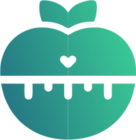

# Template padrão da aplicação

Pré-requisitos: <a href="03-Product-design.md"> Especificação do projeto</a>, <a href="04-Metodologia.md"> Metodologia</a>, <a href="05-Projeto-interface.md"> Projeto de interface</a>

## Identidade Visual da Aplicação

A identidade visual da aplicação foi desenvolvida com o objetivo de transmitir organização, produtividade, foco e evolução pessoal, conceitos diretamente relacionados à proposta do sistema. O layout foi projetado para proporcionar uma experiência intuitiva e agradável ao usuário, utilizando elementos visuais modernos e de fácil compreensão.

A aplicação segue um padrão visual único em todas as telas, garantindo consistência na navegação e reconhecimento da marca. Além disso, os componentes foram desenvolvidos considerando aspectos de responsividade, permitindo uma boa adaptação a diferentes tamanhos de tela e dispositivos.

## Paleta de Cores

A paleta de cores foi definida com base nos valores que a aplicação pretende transmitir aos usuários.

Verde (#41D09A): representa equilíbrio, foco, crescimento, bem-estar e desenvolvimento pessoal.

Azul (#1B6A82): representa organização, confiança, estabilidade, segurança e produtividade.

A combinação dessas cores busca criar uma identidade visual moderna, agradável e alinhada ao propósito da aplicação.

## Iconografia

Para garantir padronização visual em todas as telas do sistema, foi definido um conjunto de ícones para representar as principais funcionalidades da aplicação. A utilização de símbolos padronizados facilita a navegação do usuário e contribui para uma melhor experiência de uso.

Os ícones seguem o mesmo estilo visual e são utilizados de forma consistente em toda a interface.

Ícones utilizados na aplicação:

.png)

.png)
.png)

## Processo de criação e Siginicado da Logo

A logo da aplicação foi desenvolvida para representar os principais conceitos trabalhados pelo sistema: gestão do tempo, produtividade, organização e crescimento pessoal.

O elemento circular presente na marca remete a um relógio, simbolizando o gerenciamento eficiente do tempo e o planejamento das atividades diárias. Os marcadores distribuídos ao redor do círculo reforçam essa associação, representando a organização da rotina e o controle das tarefas.

No centro da composição, a seta ascendente simboliza evolução, progresso e alcance de objetivos. Seu formato também remete a um gráfico de crescimento, representando a funcionalidade de acompanhamento de desempenho oferecida pela aplicação.

As cores verde e azul foram incorporadas à identidade visual para reforçar os valores da plataforma. Enquanto o verde representa crescimento, equilíbrio e bem-estar, o azul transmite organização, estabilidade e confiança.

Dessa forma, a logo busca comunicar visualmente a proposta do aplicativo de auxiliar estudantes e profissionais na administração do tempo, na organização de atividades e na melhoria contínua da produtividade.

.png)

## Tipografia

A tipografia utilizada na aplicação é a família Arial, escolhida por sua legibilidade, simplicidade e ampla compatibilidade entre diferentes dispositivos e sistemas operacionais. A utilização dessa fonte contribui para uma experiência de leitura clara e objetiva, favorecendo a usabilidade da aplicação.

Foram definidas as seguintes variações tipográficas:

* Arial Bold: utilizada em títulos, cabeçalhos e informações que necessitam maior destaque visual.
* Arial Regular: utilizada no conteúdo principal, descrições e textos informativos.
* Arial Italic: utilizada em observações, mensagens auxiliares e informações complementares.

A padronização tipográfica garante consistência visual em todas as telas da aplicação, contribuindo para a organização da interface e para uma melhor experiência do usuário.

## Aspectos da responsividade

A aplicação foi desenvolvida considerando princípios de responsividade, permitindo que a interface se adapte adequadamente a diferentes tamanhos de tela. Os elementos visuais, como menus, botões, ícones e campos de interação, mantêm sua organização e legibilidade independentemente da resolução do dispositivo utilizado.

Essa abordagem proporciona uma experiência de navegação mais confortável e intuitiva, garantindo que as funcionalidades da aplicação possam ser acessadas de forma eficiente em diferentes dispositivos móveis.

## Aplicação do Template

A seguir é apresentada uma tela de exemplo demonstrando a aplicação da identidade visual da plataforma, incluindo o uso da paleta de cores, dos ícones padronizados, da tipografia e da estrutura visual definida para o sistema.

// colocar telas

> **Links úteis**:
>
> - [CSS website layout (W3Schools)](https://www.w3schools.com/css/css_website_layout.asp)
> - [Website page layouts](http://www.cellbiol.com/bioinformatics_web_development/chapter-3-your-first-web-page-learning-html-and-css/website-page-layouts/)
> - [Perfect liquid layout](https://matthewjamestaylor.com/perfect-liquid-layouts)
> - [How and why icons improve your web design](https://usabilla.com/blog/how-and-why-icons-improve-you-web-design/)
